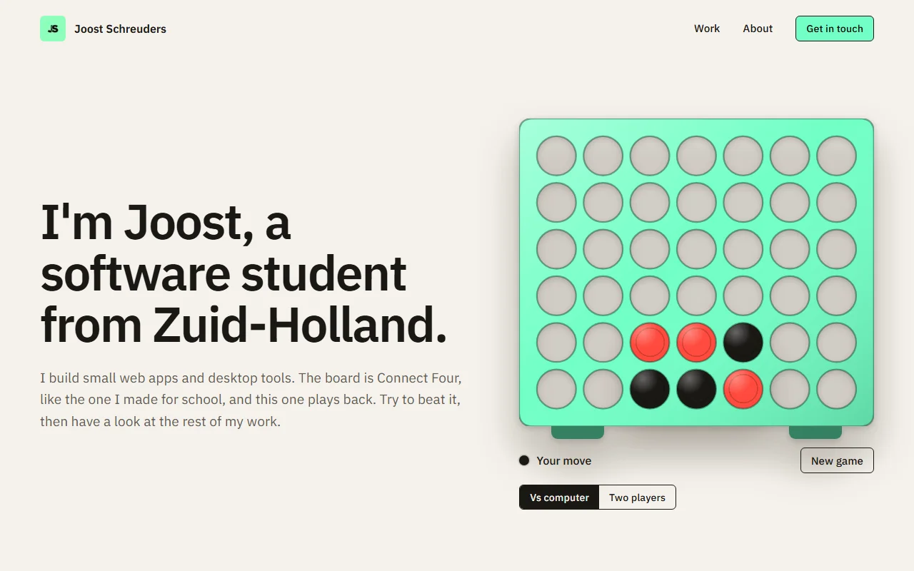
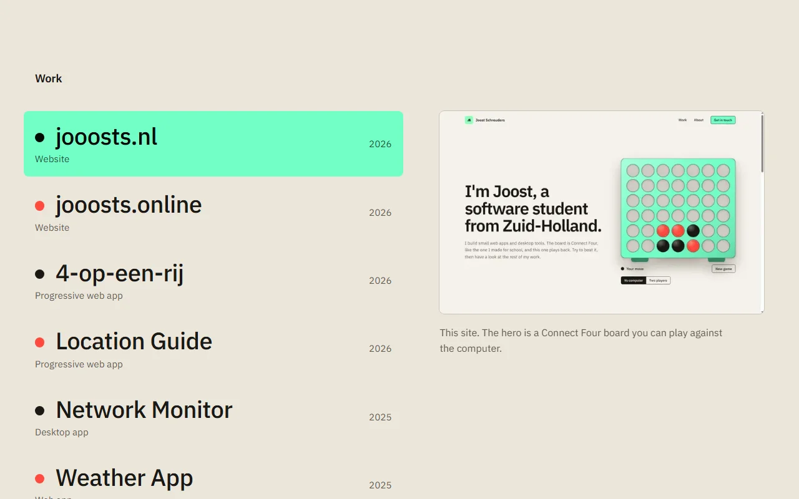

                                                  # portfolio-v2

The portfolio of Joost Schreuders, a student software developer from Zuid-Holland, the Netherlands:
small apps, useful tools and the occasional game.

<picture>
  <source media="(prefers-color-scheme: dark)" srcset="docs/hero-dark.webp">
  
</picture>

<picture>
  <source media="(prefers-color-scheme: dark)" srcset="docs/work-dark.webp">
  
</picture>

## What is in it

- **A playable Connect Four hero.** Play a computer opponent (a depth-5 minimax search) or a second player.
  Six discs drop in as an opening, a ghost disc follows the column you point at, and the winning four flash.
- **A work list built from GitHub.** Projects are read live from the GitHub API for `JooostS` and each gets a
  case-study page at `/work/<slug>`. Hovering a row previews the project without leaving the page.
- **Light and dark mode** that follow the system: warm paper and warm charcoal, with the mint `#71ffc5` from
  the profile picture on the board, buttons and the active row.
- **A colour picker.** Five accents in the footer recolour the board, buttons and highlights, ease between
  colours and are remembered. The footer also shows the local time in Zuid-Holland.
- **Share images** for the home page and every project, drawn at build time with `next/og`.
- **Careful with links.** A live demo is only shown if it is publicly reachable, so a deployment behind a
  login wall is hidden instead of sending visitors to a login page.
- **Accessible.** Labelled controls, visible focus rings, `prefers-reduced-motion` respected, and checked
  down to a 390px screen width.

## Tech

Next.js 16 (App Router, Turbopack), React 19 and TypeScript. Styling is plain CSS with custom properties, with
no UI library and no CSS framework. The font is IBM Plex Sans through `next/font`.

## Getting started

You need Node.js 20.9 or newer.

```bash
npm install
npm run dev      # http://localhost:3000
```

To build and run it for production:

```bash
npm run build
npm start
```

### GitHub token (optional)

The project list is fetched from the GitHub API without logging in, which allows 60 requests per hour. If you
hit that limit, or build often, create a `.env.local` file with a token. It needs no scopes, because only public
data is read:

```bash
GITHUB_TOKEN=your_token_here
```

If GitHub can't be reached at all, the site falls back to a built-in snapshot of the projects, so a build never
fails because of the network.

## How the projects work

`lib/github.ts` does four things:

1. Fetches the public repos of `JooostS`, cached for an hour.
2. Skips forks, archived repos, the profile repo, and repos that have neither a description nor a homepage
   (unless they have a `CURATED` entry).
3. Merges in the hand-written copy from the `CURATED` table (title, type, summary, features, stack, tint colour
   and screenshot).
4. Checks each live URL and hides it if it redirects to a Vercel login.

A new repo shows up on the site on its own, using its GitHub description. To give it proper copy, add an entry
to `CURATED`, keyed by the lowercased repo name, and put a screenshot in `public/work/`.

## Project structure

```
app/
  layout.tsx              font, metadata, theme colours
  page.tsx                home page: hero, work, about, contact
  globals.css             design tokens, light and dark schemes, all styles
  opengraph-image.tsx     share image for the home page
  work/[slug]/            case-study pages and their share images
components/
  Board.tsx               the Connect Four board
  WorkIndex.tsx           work list with the sticky preview
  Contact.tsx             dark contact band and footer (with AccentPicker, CopyEmail and LocalTime)
lib/
  connect4.ts             game rules and the computer opponent
  github.ts               GitHub data, project copy, link checks
  og.tsx                  share image layout
public/work/              project screenshots
DESIGN.md                 design system, decisions and open items
```

## Design

The tokens, type scale, components and the reasoning behind them are written up in [DESIGN.md](DESIGN.md).

## Deployment

It runs on any host that can run a Node server (`npm run build && npm start`), and on Vercel. The project list
revalidates every hour, so new repos appear without a redeploy.

If you deploy under a different domain, set `metadataBase` in `app/layout.tsx` (it is currently
`https://jooosts.nl`), so the share images get the right address.
